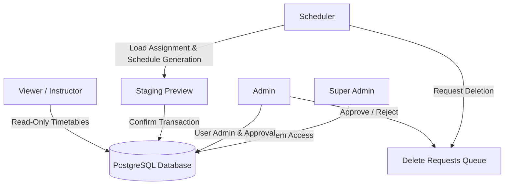
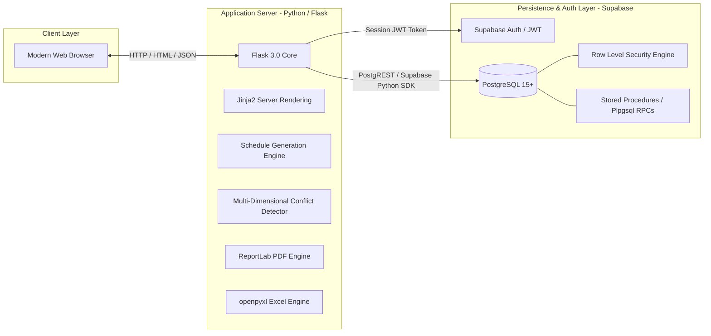
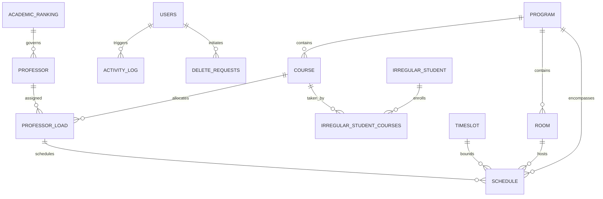
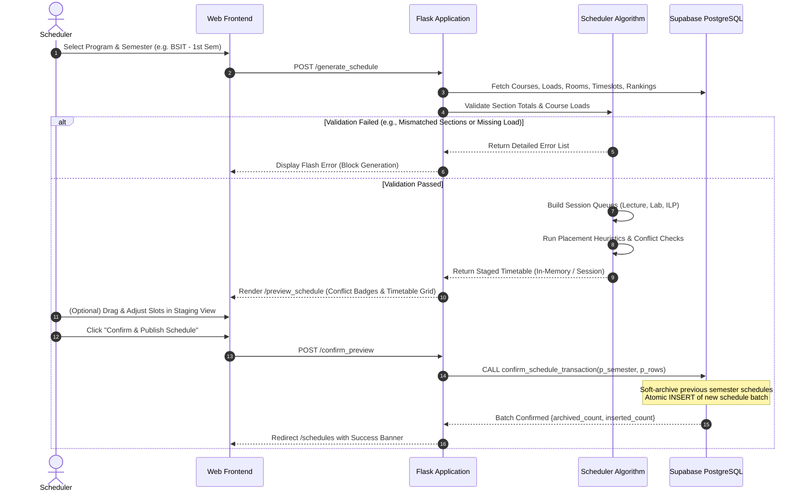
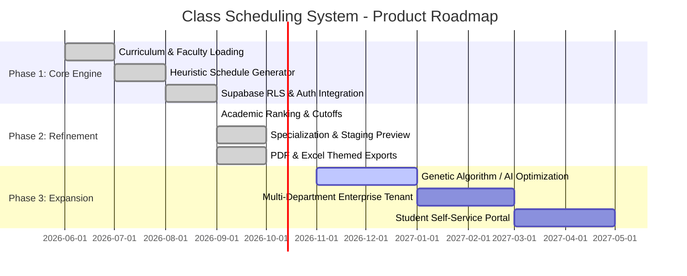

# Product Requirements Document (PRD)

## University Class Scheduling and Room Allocation System with Conflict Detection

| Document Version | 2.1.0 |
| :--- | :--- |
| **System Status** | Production / Active Local Deployment |
| **Last Updated** | October 2026 |
| **Primary Authors** | Capstone Development Team |
| **Target Department** | College of Information and Communications Technology (CICT) / BSIT |
| **Repository** | [YANAMI03/ClassScheduling](file:///c:/Users/micko/OneDrive/Desktop/ClassScheduling) |

---

## Table of Contents

1. [Executive Summary & System Overview](#1-executive-summary--system-overview)
2. [User Personas, Roles & Access Control (RBAC)](#2-user-personas-roles--access-control-rbac)
3. [System Architecture & Technology Stack](#3-system-architecture--technology-stack)
4. [Data Models & Database Architecture](#4-data-models--database-architecture)
5. [Core Functional Modules & Detailed Specifications](#5-core-functional-modules--detailed-specifications)
   - [5.1 Program & Curriculum Management](#51-program--curriculum-management)
   - [5.2 Academic Ranking & Faculty Capacity Framework](#52-academic-ranking--faculty-capacity-framework)
   - [5.3 Course Catalog & Track Specialization](#53-course-catalog--track-specialization)
   - [5.4 Faculty Workload Allocation (`professor_load`)](#54-faculty-workload-allocation-professor_load)
   - [5.5 Physical Facilities & Room Inventory](#55-physical-facilities--room-inventory)
   - [5.6 Institutional Timeslots & Professor Cutoffs](#56-institutional-timeslots--professor-cutoffs)
   - [5.7 Automated Schedule Generation Engine](#57-automated-schedule-generation-engine)
   - [5.8 Multi-Dimensional Conflict Detection Engine](#58-multi-dimensional-conflict-detection-engine)
   - [5.9 Staging, Interactive Preview & Transactional Commitment](#59-staging-interactive-preview--transactional-commitment)
   - [5.10 Timetable Visualization & Dashboards](#510-timetable-visualization--dashboards)
   - [5.11 Irregular Student Schedule Builder](#511-irregular-student-schedule-builder)
   - [5.12 Schedule Archiving & Historical Batch Versioning](#512-schedule-archiving--historical-batch-versioning)
   - [5.13 Document Export Subsystem (PDF & Excel)](#513-document-export-subsystem-pdf--excel)
   - [5.14 Two-Phase Deletion Request & Approval Workflow](#514-two-phase-deletion-request--approval-workflow)
   - [5.15 Disaster Recovery, Backup & Restore](#515-disaster-recovery-backup--restore)
6. [Business Rules, Validations & Edge Case Logic](#6-business-rules-validations--edge-case-logic)
7. [Non-Functional Requirements (NFRs)](#7-non-functional-requirements-nfrs)
8. [Deployment, Environment & Operational Guidelines](#8-deployment-environment--operational-guidelines)
9. [Future Roadmap & Milestones](#9-future-roadmap--milestones)

---

## 1. Executive Summary & System Overview

### 1.1 Purpose
The **University Class Scheduling and Room Allocation System with Conflict Detection** is an enterprise-grade academic timetable generator and facility allocation platform. It automates institutional semester timetable creation while providing department schedulers with granular manual adjustment capabilities and immediate, real-time multi-dimensional conflict detection.

### 1.2 Problem Statement
Manual scheduling in higher education institutions suffers from systemic inefficiencies:
* **Severe Resource Contention:** Accidental double-booking of specialized laboratory spaces and high-demand lecture halls.
* **Faculty Overload & Rank Violations:** Scheduling professors beyond institutional workload limits, breaching minimum/maximum unit quotas, or assigning classes past allowable evening cutoff times.
* **Student Pedagogical Inefficiencies:** Poor distribution of courses across the week (e.g., student sections forced into 4+ subjects in a single day, or excessive late-evening sessions).
* **Specialization Clashes:** Third- and Fourth-year elective tracks (Database Systems, Web Systems, Networking) colliding with mandatory general university courses.
* **Irregular Student Disruption:** Students re-taking failed or deferred courses facing schedule overlaps across mismatched year levels.
* **Manual Administrative Overhead:** Weeks of cross-referencing paper or disconnected spreadsheet schedules, where a single change causes cascading schedule breakdowns.

### 1.3 System Scope
* **Institutional Scope:** Primary focus on the College of Information and Communications Technology (CICT) / Bachelor of Science in Information Technology (BSIT) program, with modular architecture ready for university-wide expansion.
* **Cadence:** Semester-based scheduling (`1st Semester` and `2nd Semester`).
* **Instructional Typologies:** Supports 3 distinct session types:
  1. `Lecture`: Theory sessions assigned strictly to lecture rooms.
  2. `Laboratory`: Practical hands-on sessions assigned strictly to computer/science laboratories.
  3. `ILP` (Instructional Laboratory Period / Practice): 1-hour supplementary instructional lab periods assigned to lecture rooms.
* **Core Philosophy:** **Faculty Load-Driven Scheduling**. Schedules are derived directly from pre-approved faculty course assignments (`professor_load`), eliminating orphaned or unauthorized classes.

### 1.4 Success Metrics (KPIs)
* **Turnaround Reduction:** Decrease complete semester timetable generation time from 2–3 weeks to under 30 seconds.
* **Zero Conflict Guarantee:** 0 room double-bookings, 0 professor overlaps, 0 section overlaps, and 0 cutoff violations upon schedule confirmation.
* **100% Policy Adherence:** Exact adherence to Academic Ranking teaching limits (units and hours) and room-type compatibility.
* **Zero Accidental Data Loss:** Transactional staging preview and soft-archival before committing any new schedule.

---

## 2. User Personas, Roles & Access Control (RBAC)

The system enforces a strict Role-Based Access Control (RBAC) architecture backed by PostgreSQL Row Level Security (RLS) policies and JWT metadata validation.



### 2.1 User Personas

#### 1. Super Admin
* **Profile:** Institutional IT Administrator / System Owner.
* **Responsibilities:** Full administrative jurisdiction. Manages server configurations, users, programs, raw database disaster recovery backups and restores, and can bypass deletion approval bottlenecks.

#### 2. Academic Admin (Dean / Department Chairperson)
* **Profile:** Academic Department Head / Dean / Associate Dean.
* **Responsibilities:** Establishes departmental policies, configures academic ranking constraints, oversees faculty load allocations, manages user accounts, and reviews/approves/rejects deletion requests submitted by schedulers.

#### 3. Department Scheduler
* **Profile:** Dedicated Faculty Scheduler / Academic Coordinator.
* **Responsibilities:** Day-to-day scheduling operator. Enters curriculum course offerings, assigns section quotas to professors (`professor_load`), initiates automated schedule generation, edits draft sessions via interactive drag/grid views, confirms final schedules, and submits deletion requests when entities must be decommissioned.

#### 4. Instructor / Viewer
* **Profile:** Full-time and Adjunct Professors, Students, and Staff.
* **Responsibilities:** Read-only access to published timetable matrices. Views individual faculty loading, section schedules, and room availability grids. Can export official PDF and Excel timetables.

### 2.2 Permissions Matrix

| Feature / Resource | Super Admin | Academic Admin | Scheduler | Instructor / Viewer |
| :--- | :---: | :---: | :---: | :---: |
| **Manage Users & Roles** | Full CRUD | Full CRUD | None | None |
| **Academic Rankings Config** | Full CRUD | Full CRUD | View Only | View Only |
| **Course Catalog** | Full CRUD | Full CRUD | Create / Edit / Request Del | View Only |
| **Faculty Records** | Full CRUD | Full CRUD | Create / Edit / Request Del | View Profile |
| **Faculty Load Allocation** | Full CRUD | Full CRUD | Full CRUD | View Own |
| **Rooms & Facilities** | Full CRUD | Full CRUD | Create / Edit / Request Del | View Availability |
| **Timeslots & Cutoffs** | Full CRUD | Full CRUD | View Only | View Only |
| **Generate Draft Schedule** | Yes | Yes | Yes | No |
| **Edit Staging Preview** | Yes | Yes | Yes | No |
| **Confirm / Publish Schedule** | Yes | Yes | Yes | No |
| **Archive Active Schedule** | Yes | Yes | Yes | No |
| **Restore Archived Schedule** | Yes | Yes | Yes | No |
| **Delete Live Schedule** | Direct Delete | Direct Delete | Request Approval | No |
| **Irregular Student Builder** | Full CRUD | Full CRUD | Full CRUD | View Own |
| **Export Official PDF/Excel** | Yes | Yes | Yes | Yes |
| **Database Backup & Restore** | Yes | Yes | No | No |

---

## 3. System Architecture & Technology Stack

The application leverages a hybrid architecture combining a high-performance Python/Flask application server with Supabase (managed PostgreSQL) implementing defense-in-depth security via Row Level Security (RLS).



### 3.1 Technology Stack Details

| Layer | Component | Description & Rationale |
| :--- | :--- | :--- |
| **Backend Runtime** | Python 3.11+ / Flask | Lightweight, robust web framework with rich mathematical and parsing libraries for combinatorial schedule placement. |
| **Database** | PostgreSQL 15+ (Supabase) | ACID-compliant relational engine with JSONB support, strict foreign keys, and stored procedures for atomic transactions. |
| **Authentication** | Supabase Auth | Secure password hashing, session tokens, and JWT issuance supporting both username and email authentication. |
| **Data Protection** | PostgreSQL RLS | Strict database-level isolation. Requests execute via authenticated client session JWTs using the public `SUPABASE_ANON_KEY`; no `service_role` key is ever exposed. |
| **Frontend UI** | Vanilla HTML5, CSS3, JS | Highly responsive, premium design system without heavy framework overhead. Utilizes modern glassmorphism, responsive CSS Grid timetables, and micro-animations. |
| **Document Generation** | ReportLab 4.0+ | Vector-based PDF generation supporting landscape layout, two-pass dynamic page numbering ("Page X of Y"), and institutional headers. |
| **Spreadsheet Engine** | openpyxl 3.1+ | Formula-aware Excel generation featuring 7 selectable institutional color themes and cross-sheet formatting. |
| **Containerization** | Docker & Docker Compose | Multi-stage Docker containers with volume mounting for live development code reloading. |

---

## 4. Data Models & Database Architecture

### 4.1 Entity Relationship Diagram (ERD)



### 4.2 Data Dictionaries

#### 4.2.1 `program`
Represents an academic department or degree program.
* `id` (INTEGER, PK, Auto-increment)
* `program_name` (VARCHAR(100), UNIQUE, NOT NULL): e.g., `'BSIT'`, `'BSCS'`.
* `department` (VARCHAR(100), NOT NULL): e.g., `'CICT'`.
* `created_at` (TIMESTAMPTZ, DEFAULT NOW())

#### 4.2.2 `academic_ranking`
Defines institutional faculty rank categories and workload thresholds.
* `academic_ranking_id` (INTEGER, PK, Auto-increment)
* `name` (VARCHAR(100), NOT NULL): e.g., `'Instructor I'`, `'Associate Professor'`, `'LOHB'`.
* `min_units` (NUMERIC(5,2), NOT NULL, DEFAULT 0.00)
* `max_units` (NUMERIC(5,2), NOT NULL, DEFAULT 24.00)
* `min_hours` (NUMERIC(5,2), NOT NULL, DEFAULT 0.00)
* `max_hours` (NUMERIC(5,2), NOT NULL, DEFAULT 40.00)
* `has_cutoff` (BOOLEAN, NOT NULL, DEFAULT TRUE): When `TRUE`, faculty cannot teach past timeslot evening cutoffs. Set to `FALSE` for adjunct / LOHB faculty.

#### 4.2.3 `professor`
Represents an academic instructor.
* `prof_id` (INTEGER, PK, Auto-increment)
* `first_name` (VARCHAR(100), NOT NULL)
* `last_name` (VARCHAR(100), NOT NULL)
* `email` (VARCHAR(150), UNIQUE)
* `specialization` (VARCHAR(100)): Primary discipline (e.g., `'Web Systems'`, `'Database Systems'`, `'Networking'`).
* `academic_ranking_id` (INTEGER, FK -> `academic_ranking.academic_ranking_id`, ON DELETE SET NULL)
* `program_id` (INTEGER, FK -> `program.id`, ON DELETE CASCADE)

#### 4.2.4 `course`
Curriculum subject catalog.
* `course_id` (INTEGER, PK, Auto-increment)
* `course_name` (VARCHAR(150), NOT NULL): e.g., `'IT-WS01 Web Development'`.
* `year_level` (INTEGER, NOT NULL, CHECK 1..4)
* `semester` (VARCHAR(50), NOT NULL, DEFAULT `'1st Semester'`, CHECK IN (`'1st Semester'`, `'2nd Semester'`))
* `lecture_hours` (INTEGER, NOT NULL, DEFAULT 0)
* `lab_hours` (INTEGER, NOT NULL, DEFAULT 0)
* `ilp_hours` (INTEGER, NOT NULL, DEFAULT 0, CHECK IN (0, 1)): 1-hour instructional lab period.
* `units` (NUMERIC(4,2), NOT NULL, DEFAULT 3.0)
* `course_type` (VARCHAR(50), NOT NULL, DEFAULT `'Lecture'`, CHECK IN (`'Lecture'`, `'Laboratory'`, `'Paired'`))
* `specialization` (VARCHAR(50), CHECK IN (`'Database Systems'`, `'Web Systems'`, `'Networking'`, `'General'`, NULL))
* `program_id` (INTEGER, FK -> `program.id`, ON DELETE CASCADE)

#### 4.2.5 `professor_load`
The authoritative binding of a professor to a specific course and section quota.
* `id` (INTEGER, PK, Auto-increment)
* `prof_id` (INTEGER, NOT NULL, FK -> `professor.prof_id`, ON DELETE CASCADE)
* `course_id` (INTEGER, NOT NULL, FK -> `course.course_id`, ON DELETE CASCADE)
* `sections` (INTEGER, NOT NULL, CHECK > 0): Number of section instances assigned to this instructor.
* `ilp_hours` (INTEGER, NOT NULL, DEFAULT 0, CHECK IN (0, 1))

#### 4.2.6 `room`
Instructional facilities.
* `room_id` (INTEGER, PK, Auto-increment)
* `room_name` (VARCHAR(100), NOT NULL): e.g., `'Lab 301'`, `'Room 402'`.
* `room_type` (VARCHAR(50), NOT NULL, CHECK IN (`'Lecture'`, `'Laboratory'`))
* `capacity` (INTEGER, DEFAULT 40)
* `program_id` (INTEGER, FK -> `program.id`, ON DELETE CASCADE)

#### 4.2.7 `timeslot`
Institutional operating schedule boundaries per day of the week.
* `timeslot_id` (INTEGER, PK, Auto-increment)
* `day` (VARCHAR(20), NOT NULL): `'Monday'`, `'Tuesday'`, `'Wednesday'`, `'Thursday'`, `'Friday'`.
* `start_time` (TIME, NOT NULL): Default `'07:00:00'`.
* `end_time` (TIME, NOT NULL): Default `'20:00:00'`.
* `lunch_time` (TIME, NOT NULL): Default `'12:00:00'`.
* `professor_cutoff` (TIME): Default `'16:00:00'` for Monday, `'17:00:00'` for Tue–Fri.

#### 4.2.8 `schedule`
The committed timetable entries.
* `schedule_id` (INTEGER, PK, Auto-increment)
* `program_id` (INTEGER, NOT NULL, FK -> `program.id`, ON DELETE CASCADE)
* `professor_load_id` (INTEGER, NULLABLE, FK -> `professor_load.id`, ON DELETE SET NULL): NULL indicates an unassigned fallback slot.
* `room_id` (INTEGER, NULLABLE, FK -> `room.room_id`, ON DELETE SET NULL): NULL indicates a TBA room.
* `section` (VARCHAR(50), NOT NULL): e.g., `'1A'`, `'3B-Web Systems'`.
* `semester` (VARCHAR(50), NOT NULL, DEFAULT `'1st Semester'`)
* `day` (VARCHAR(20), NOT NULL)
* `class_start` (TIME, NOT NULL)
* `class_end` (TIME, NOT NULL)
* `session_type` (VARCHAR(50), NOT NULL, CHECK IN (`'Lecture'`, `'Laboratory'`, `'ILP'`))
* `major` (VARCHAR(50), NULLABLE): Specialization tag.
* `archive` (BOOLEAN, NOT NULL, DEFAULT FALSE)
* `batch_id` (UUID, NOT NULL)

#### 4.2.9 `delete_requests`
Two-phase approval log for scheduler-initiated deletions.
* `id` (INTEGER, PK, Auto-increment)
* `entity_type` (VARCHAR(50), NOT NULL): `'professor'`, `'course'`, `'room'`, `'academic_ranking'`, `'schedule'`.
* `entity_id` (INTEGER, NOT NULL)
* `entity_label` (VARCHAR(255), NOT NULL)
* `reason` (TEXT)
* `requested_by` (VARCHAR(100), NOT NULL)
* `status` (VARCHAR(30), NOT NULL, DEFAULT `'Pending'`, CHECK IN (`'Pending'`, `'Approved'`, `'Rejected'`))
* `reviewed_by` (VARCHAR(100))
* `reviewed_at` (TIMESTAMPTZ)
* `created_at` (TIMESTAMPTZ, DEFAULT NOW())

---

## 5. Core Functional Modules & Detailed Specifications



### 5.1 Program & Curriculum Management
* **Single Department Optimization:** Configured for departmental administration with isolated program IDs.
* **Curriculum Year Levels:** Year 1 through Year 4.
* **Normalized Semester Structure:** All course offerings and schedules are strictly bound to either `1st Semester` or `2nd Semester`.

### 5.2 Academic Ranking & Faculty Capacity Framework
* Replaces legacy hardcoded faculty workload limits with a dynamic, institutional rank table.
* **Workload Bounds:** Enforces `min_units`, `max_units`, `min_hours`, and `max_hours`.
* **Daily Evening Cutoff Constraint (`has_cutoff`):**
  * Standard faculty cannot be assigned classes ending after the institutional cutoff (16:00 on Monday, 17:00 on Tuesday–Friday).
  * Adjunct/Part-Time ranks (e.g., `LOHB`) have `has_cutoff = false` and can teach classes up to the 20:00 facility closing boundary.
  * 1-hour `ILP` sessions are explicitly exempt from evening cutoff restrictions.

### 5.3 Course Catalog & Track Specialization
* Tracks `lecture_hours`, `lab_hours`, `ilp_hours`, and `units`.
* **Track Specialization Model:**
  * Supported values: `Database Systems`, `Web Systems`, `Networking`, and `General`.
  * **Non-Specialized Terms:** (Year 1, Year 2, Year 3 1st Semester). All courses must have identical section quotas per year level.
  * **Specialized Terms:** (Year 3 2nd Semester, Year 4 1st Semester, Year 4 2nd Semester).
    * Specialization courses form independent cohorts (e.g., Section `3A-Database Systems`, `3B-Database Systems`).
    * General courses are core institutional subjects taken across all tracks; total sections allocated to a General course must exactly equal the sum of sections across all specialization tracks in that term.

### 5.4 Faculty Workload Allocation (`professor_load`)
* Primary operational junction linking instructor to subject.
* Schedulers specify the exact number of sections assigned to an instructor for a given course.
* Real-time metrics compute total assigned teaching hours:
  $$\text{Total Hours} = (\text{Lecture Hours} + \text{Lab Hours} + \text{ILP Hours}) \times \text{Sections}$$
  $$\text{Total Units} = \text{Units} \times \text{Sections}$$
* Visual warnings notify schedulers if an allocation violates the instructor's ranking limits.
* Built-in sanitization automatically repairs corrupted legacy section counts (e.g., placeholder 999 values).

### 5.5 Physical Facilities & Room Inventory
* **Strict Typing:** Rooms are typed as `Lecture` or `Laboratory`.
* **Compatibility Rule:**
  * `Lecture` sessions $\rightarrow$ `Lecture` room only.
  * `Laboratory` sessions $\rightarrow$ `Laboratory` room only.
  * `ILP` sessions $\rightarrow$ `Lecture` room only.
* **Equal Room Distribution Algorithm:** Balances section distribution evenly across all suitable rooms in the inventory to prevent over-clustering in a single facility.
* **Graceful Degradation:** If room inventory is completely saturated, the session is created with room designated as `'TBA'` and highlighted with a conflict badge.

### 5.6 Institutional Timeslots & Professor Cutoffs
* Operational window: Monday through Friday, 07:00 to 20:00 (Saturday removed).
* **Lunch Period Exclusion:** Institutional lunch hour (12:00 to 13:00) is strictly locked. No classes may start, end, or overlap across this window.
* **Configurable Evening Cutoffs:** Maintained on the `timeslot` record per day and cross-referenced against `academic_ranking.has_cutoff`.

### 5.7 Automated Schedule Generation Engine

#### 5.7.1 Pre-Generation Validation Checklist
Before executing combinatorial placement, the engine runs strict data integrity validations:
1. **Zero-Load Detection:** If any course in the curriculum for the target semester has 0 rows in `professor_load`, generation aborts immediately with an explanatory error.
2. **Section Consistency Check:**
   * In non-specialized terms: all courses must have equal section counts.
   * In specialized terms: all tracks must have valid counts, and General courses must match the sum of specialization sections.
3. **Active Schedule Collision Check:** If an active schedule already exists for the *same* semester and program, generation is blocked to prevent accidental overwrite.

#### 5.7.2 Session Queue Construction
For each course and section instance, the engine decomposes the subject into atomic schedulable blocks:
* **Lecture Only:** One continuous session of $N$ hours.
* **Lab Only:** One continuous session of $N$ hours.
* **Paired (Lecture + Lab):** Separated into a Lecture block and a Laboratory block placed on separate days or distinct time blocks.
* **ILP Session:** Dedicated 1-hour session placed independently in a lecture facility.

#### 5.7.3 Pedagogical Placement Heuristics
* **1st Year Rule:** Maximum of 2 courses per day, distributed once per week across the Monday–Friday matrix.
* **2nd Year Rule:** Maximum of 2 late classes (> 17:00) per week.
* **3rd & 4th Year Rule:** Prefer 2 courses per day, grouped by specialization track.

### 5.8 Multi-Dimensional Conflict Detection Engine
Active both during automated schedule generation and manual grid editing. Evaluates 5 dimensions of scheduling conflict:
1. **Professor Conflict:** Instructor double-booked at overlapping days and times.
2. **Room Conflict:** Physical room scheduled for more than one class simultaneously.
3. **Section Conflict:** Same student cohort scheduled for multiple concurrent subjects.
4. **Lunch Hour Conflict:** Session encroaching upon the 12:00–13:00 institutional lunch window.
5. **Evening Cutoff Conflict:** Instructor scheduled past the daily ranking cutoff without an exemption.

### 5.9 Staging, Interactive Preview & Transactional Commitment
* **Staged Sandboxing:** Generated timetables are initially written to an isolated session preview (`preview_schedule`).
* **Visual Conflict Badging:** Red and amber indicators highlight any unavoidable TBA rooms or cutoff warnings.
* **Interactive Adjustments:** Schedulers can adjust session days, start times, and rooms in-place via `/edit_preview_entry`.
* **Atomic PostgreSQL RPC Confirmation:** Committing invokes the stored procedure `confirm_schedule_transaction`:
  * Atomically soft-archives existing active schedules for that semester/program.
  * Performs bulk `INSERT` of new validated schedule rows.
  * Preserves foreign key integrity (unassigned slots store `professor_load_id = NULL` rather than dummy load records).
* **Safe Discard:** Schedulers can click "Discard Preview" at any time to purge staging state without modifying live database tables.

### 5.10 Timetable Visualization & Dashboards
* **Section Timetable View:** Weekly grid (Monday–Friday, 7:00 AM – 8:00 PM) color-coded by course, displaying course code, instructor, room, and session type.
* **Faculty Workload Dashboard:** Displays assigned weekly teaching hours, total units, remaining capacity relative to academic ranking limits, and visual timetable.
* **Room Utilization Matrix:** Weekly calendar per room highlighting booked blocks, idle slots, and overall capacity utilization.

### 5.11 Irregular Student Schedule Builder
* Dedicated submodule for irregular students who take cross-year or cross-section subjects.
* Allows academic advisors to enroll an irregular student into individual courses across different sections.
* Renders a personalized weekly timetable and runs real-time student conflict detection to verify that selected sections do not clash.

### 5.12 Schedule Archiving & Historical Batch Versioning
* Each confirmed schedule generation is tagged with a unique `batch_id` (UUID).
* Active schedule entries maintain `archive = false`.
* **Single Active Schedule Rule:** Only one active schedule batch can exist per program and semester.
* Schedulers can browse historical schedules in the `/schedule_archive` repository, inspect past batch details, and perform a one-click rollback/restore.

### 5.13 Document Export Subsystem (PDF & Excel)

#### 5.13.1 ReportLab PDF Engine (`pdf_export.py`)
* Generates landscape Letter-sized timetable documents.
* Custom `NumberedCanvas` performs dynamic two-pass calculation of total pages ("Page X of Y").
* Includes institutional header, academic term, section metadata banner, and color-coded table cells.

#### 5.13.2 openpyxl Excel Engine (`excel_export.py`)
* Generates formatted Excel spreadsheets representing the weekly grid.
* Supports **7 Curated Institutional Color Themes**:
  1. *Classic Blue* (Navy / Ice Blue)
  2. *Crimson Red* (Deep Red / Blush)
  3. *Forest Green* (Emerald / Mint)
  4. *Royal Purple* (Indigo / Lavender)
  5. *Sunset Orange* (Amber / Warm Cream)
  6. *Ocean Teal* (Teal / Cyan Soft)
  7. *Slate Minimalist* (Charcoal / Off-White)
* Schedulers can configure and persist default export themes per section via `/api/section_theme`.

### 5.14 Two-Phase Deletion Request & Approval Workflow
To prevent accidental disruption of live schedules, schedulers do not possess direct hard-deletion privileges on foundational entities:
1. When a Scheduler deletes a Professor, Course, Room, or Schedule, the system creates a pending entry in `delete_requests`.
2. Academic Admins and Super Admins receive notification badges in the navigation bar.
3. Admins review the entity details and justification reason, then click **Approve** (executing deletion) or **Reject** (canceling request).

### 5.15 Disaster Recovery, Backup & Restore
* **Full JSON Snapshot Backup (`/backup`):** Triggers a PostgreSQL RPC that serializes all programs, rankings, professors, courses, rooms, timeslots, loads, and schedules into a single structured JSON payload.
* **Transactional Restore (`/restore`):** Accepts a verified backup file, validates schema versioning, and performs an atomic database restoration within a single transaction block.

---

## 6. Business Rules, Validations & Edge Case Logic

```
+------------------------------------------------------------------------------------+
|                       PRE-GENERATION VALIDATION PIPELINE                           |
+------------------------------------------------------------------------------------+
  [Program & Semester Selected]
                |
                v
  Check 1: Does an active schedule for this SAME semester already exist?
           YES --> [BLOCK: "Active schedule exists. Archive it first."]
           NO  --> Continue
                |
                v
  Check 2: Does any course in this semester have 0 assigned professor loads?
           YES --> [BLOCK: "<Course Name> has no assigned load."]
           NO  --> Continue
                |
                v
  Check 3: Is this a specialized term (3rd Yr 2nd Sem, 4th Yr 1st/2nd Sem)?
           NO  --> Ensure ALL courses in each year level have IDENTICAL section counts.
                   MISMATCH --> [BLOCK: "Mismatched section counts detected."]
           YES --> A. Ensure specialization courses form matching track cohorts.
                   B. Ensure General courses section count == SUM(all specialization tracks).
                   MISMATCH --> [BLOCK: "General course requires N sections."]
                |
                v
  [VALIDATION PASSED] --> Proceed to Session Queue & Heuristic Placement Engine
+------------------------------------------------------------------------------------+
```

### Summary of Critical Business Rules

| Rule ID | Name | Condition / Logic | Enforcement Action |
| :--- | :--- | :--- | :--- |
| **BR-001** | **Multi-Professor Aggregation** | Multiple instructors can teach sections of the same course (e.g. Prof A: 2 sections + Prof B: 1 section = 3 sections total). | Total derived sections = sum of all `sections` in `professor_load` for that course. |
| **BR-002** | **Zero-Load Blocking** | A course with 0 assigned `professor_load` rows cannot be scheduled. | Abort generation and highlight unassigned courses. |
| **BR-003** | **Section Count Uniformity** | In non-specialized terms, all courses within the same year level must have identical total sections. | Abort generation and display exact section breakdown. |
| **BR-004** | **Specialization Track Naming** | In specialized terms, sections are suffixed with track names (e.g., `3A-Web Systems`, `3A-Networking`). | Automatic section cohort grouping. |
| **BR-005** | **General Course Balancing** | In specialized terms, core General courses must have total sections equal to the sum of all specialization track sections. | Abort generation if General section count does not balance. |
| **BR-006** | **Single Active Schedule** | Only 1 active schedule (`archive = false`) permitted per program and semester. | Same semester blocks generation; different semester prompts automatic soft-archival upon confirmation. |
| **BR-007** | **Lunch Hour Immunity** | Institutional lunch hour (12:00–13:00) is locked. | Hard constraint: placement rejected if class intersects 12:00–13:00. |
| **BR-008** | **Daily Evening Cutoff** | Faculty with `has_cutoff = true` cannot be scheduled past daily cutoff (Monday 16:00, Tue–Fri 17:00). | Conflict flagged; generation attempts earlier placement slots. |
| **BR-009** | **ILP Facility & Cutoff Rules** | 1-hour `ILP` sessions must be placed in `Lecture` rooms and are exempt from evening cutoffs. | Engine routes ILP to lecture rooms and suppresses cutoff checks. |
| **BR-010** | **Room Typing Strictness** | Lecture sessions cannot be placed in computer/science labs; Lab sessions cannot be placed in lecture halls. | Hard constraint: room candidate pool filtered strictly by `room_type`. |

---

## 7. Non-Functional Requirements (NFRs)

### 7.1 Performance & Responsiveness
* **Schedule Generation Latency:** Automated timetable generation for a 4-year department curriculum (approx. 40–60 course sections) must complete within **5 seconds**.
* **Page Load Times:** Standard dashboard and timetable views must render within **1.2 seconds** under normal institutional network conditions.
* **Export Throughput:** PDF and Excel exports must compile and stream to the browser within **2.5 seconds**.

### 7.2 Security, Privacy & Integrity
* **No Secret Key Exposure:** The server-side application connects via Supabase client using public anon keys and passes authenticated user JWTs to ensure PostgreSQL RLS policy enforcement.
* **Session Management:** Secure HTTP-only cookies, automated session expiration handling, and CSRF protection.
* **SQL Injection Prevention:** All database operations utilize parameterized queries through PostgREST / Supabase SDK and stored procedures.
* **Audit Trail:** All administrative operations (login, schedule confirmation, deletion requests, user modifications) are logged to `activity_log` with timestamp, user ID, and IP address.

### 7.3 Reliability & Fault Tolerance
* **ACID Transactions:** Schedule confirmation and archival utilize PostgreSQL functions (`confirm_schedule_transaction`) guaranteeing zero partial or orphaned schedule inserts.
* **Soft Archiving:** Schedules are never permanently deleted upon replacement; they are transitioned to `archive = true` with batch UUID tracking.
* **Graceful Degradation:** Saturated room scenarios degrade gracefully to "TBA" status rather than crashing the generation engine.

### 7.4 Usability & Accessibility
* **Desktop-First Optimization:** Designed specifically for academic administrators working on desktop displays (1920x1080 and 1366x768).
* **High-Contrast Timetable Palettes:** Timetable blocks use distinct background and border contrast to ensure legibility across all course typologies.
* **Non-Modal Editing:** Schedulers can adjust draft timetable slots directly without modal popup interruptions.

---

## 8. Deployment, Environment & Operational Guidelines

### 8.1 Environment Variables
The application requires the following environment variables configured in `.env`:

```env
# Supabase Cloud Database Configuration
SUPABASE_URL=https://your-project-id.supabase.co
SUPABASE_ANON_KEY=your-supabase-anon-public-key

# Flask Application Settings
SECRET_KEY=your-strong-random-session-secret-key
FLASK_DEBUG=0
PORT=5000
```

> [!CAUTION]
> Never set or expose `SUPABASE_SECRET_KEY` (service role) in public repositories, client-side code, or container environments. The application architecture enforces RLS via authenticated user JWTs.

### 8.2 Local & Containerized Setup

#### Local Virtual Environment (Python 3.11+)
```bash
# Windows
python -m venv .venv
.venv\Scripts\activate
pip install -r requirements.txt
python app.py
```

#### Docker Compose Deployment
```bash
docker compose up --build -d
```

### 8.3 Database Migrations
Database evolutions are managed as sequential SQL migration scripts located in the `migrations/` directory:
* Standardized naming: `YYYYMMDD_feature_description.sql`.
* Every migration script is wrapped in a `BEGIN; ... COMMIT;` transaction block with idempotent checks (`IF NOT EXISTS`, `IF EXISTS`).

---

## 9. Future Roadmap & Milestones



### 9.1 Phase 1 & Phase 2 (Completed / Current Release)
* [x] Faculty load-based scheduling engine (`professor_load`).
* [x] Dynamic Academic Ranking system with daily evening cutoff constraints.
* [x] Course Specialization tracking (`Database Systems`, `Web Systems`, `Networking`, `General`).
* [x] Staged scheduling workflow (`preview_schedule` -> interactive edit -> atomic confirm).
* [x] Multi-format exports (ReportLab PDF with dynamic numbering, openpyxl Excel with 7 themes).
* [x] Irregular student cross-section timetable builder.
* [x] Two-phase deletion request queue and notification system.
* [x] Database disaster recovery backup and restore RPCs.

### 9.2 Phase 3: Future Enhancements
1. **AI / Genetic Algorithm Optimization:** Implement meta-heuristic search (Genetic Algorithms / Simulated Annealing) to optimize room proximity, minimize faculty idle gaps, and maximize student preferences.
2. **Multi-Department Institutional Scaling:** Expand tenant scoping to support multiple colleges and departments sharing university-wide auditorium and gym facilities.
3. **Student Self-Service Mobile Portal:** Responsive mobile application allowing enrolled students to view live section timetables, room changes, and personalized schedules.
4. **Google Calendar / Outlook Sync:** Integration enabling faculty to export confirmed schedules directly to institutional calendar applications via iCal/ICS feeds.
