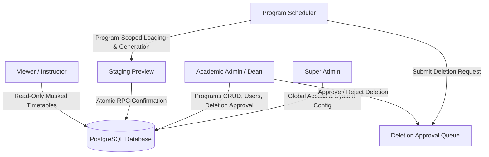
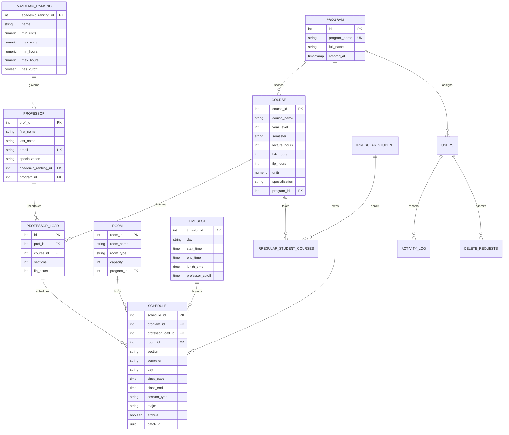
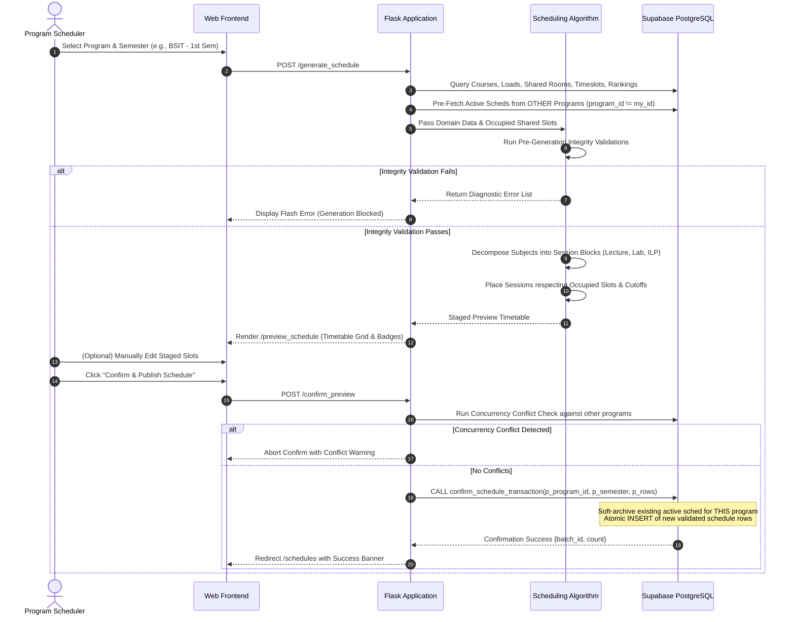
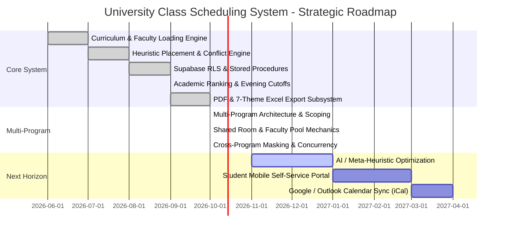

# Product Requirements Document (PRD)

## University Class Scheduling and Room Allocation System with Conflict Detection

| Document Version | 3.0.0 (Enterprise Multi-Program Edition) |
| :--- | :--- |
| **System Status** | Production / Active Multi-Program Deployment |
| **Last Updated** | October 2026 |
| **Primary Authors** | Capstone Systems Architecture Team |
| **Target Institution** | University Academic Administration / Multi-Program Colleges (e.g., CICT: BSIT, BSDS, BSCS) |
| **Repository** | [ClassScheduling](file:///c:/Users/Administrator/Oct6capstone/ClassScheduling) |

---

## Table of Contents

1. [Executive Summary & System Overview](#1-executive-summary--system-overview)
   - [1.1 Purpose & Vision](#11-purpose--vision)
   - [1.2 Problem Statement & Root Cause Analysis](#12-problem-statement--root-cause-analysis)
   - [1.3 System Scope & Operational Boundaries](#13-system-scope--operational-boundaries)
   - [1.4 Key Performance Indicators (KPIs)](#14-key-performance-indicators-kpis)
2. [User Personas, Roles & Access Control (RBAC)](#2-user-personas-roles--access-control-rbac)
   - [2.1 User Personas](#21-user-personas)
   - [2.2 Permissions Matrix & Multi-Program Scoping](#22-permissions-matrix--multi-program-scoping)
3. [System Architecture & Technology Stack](#3-system-architecture--technology-stack)
   - [3.1 High-Level Architecture Topology](#31-high-level-architecture-topology)
   - [3.2 Component & Technology Matrix](#32-component--technology-matrix)
4. [Data Models & Database Architecture](#4-data-models--database-architecture)
   - [4.1 Entity Relationship Diagram (ERD)](#41-entity-relationship-diagram-erd)
   - [4.2 Comprehensive Data Dictionary](#42-comprehensive-data-dictionary)
5. [Core Functional Modules & Detailed Specifications](#5-core-functional-modules--detailed-specifications)
   - [5.1 Academic Programs Administration](#51-academic-programs-administration)
   - [5.2 Faculty Ranks & Workload Capacities](#52-faculty-ranks--workload-capacities)
   - [5.3 Course Catalog & Specialization Framework](#53-course-catalog--specialization-framework)
   - [5.4 Shared Faculty Pool & Cross-Program Workload Allocation](#54-shared-faculty-pool--cross-program-workload-allocation)
   - [5.5 Shared Facilities & Physical Room Inventory](#55-shared-facilities--physical-room-inventory)
   - [5.6 Institutional Timeslots & Daily Cutoffs](#56-institutional-timeslots--daily-cutoffs)
   - [5.7 Automated Schedule Generation Engine](#57-automated-schedule-generation-engine)
   - [5.8 Multi-Dimensional Conflict Detection Engine](#58-multi-dimensional-conflict-detection-engine)
   - [5.9 Staging Preview, In-Place Editing & Transactional Confirmation](#59-staging-preview-in-place-editing--transactional-confirmation)
   - [5.10 Timetable Visualization & Cross-Program Privacy Masking](#510-timetable-visualization--cross-program-privacy-masking)
   - [5.11 Schedule Archiving & Conflict-Protected Restoration](#511-schedule-archiving--conflict-protected-restoration)
   - [5.12 Irregular Student Timetable Builder](#512-irregular-student-timetable-builder)
   - [5.13 Document Export Subsystem (PDF & Excel)](#513-document-export-subsystem-pdf--excel)
   - [5.14 Two-Phase Deletion Request & Approval Workflow](#514-two-phase-deletion-request--approval-workflow)
   - [5.15 Disaster Recovery, Backup & Restoration Subsystem](#515-disaster-recovery-backup--restoration-subsystem)
6. [Business Rules, Validations & Edge Case Logic](#6-business-rules-validations--edge-case-logic)
7. [Non-Functional Requirements (NFRs)](#7-non-functional-requirements-nfrs)
8. [Deployment, Environment & Operational Guidelines](#8-deployment-environment--operational-guidelines)
9. [Future Strategic Roadmap](#9-future-strategic-roadmap)

---

## 1. Executive Summary & System Overview

### 1.1 Purpose & Vision
The **University Class Scheduling and Room Allocation System with Conflict Detection** is an automated academic timetable optimization and facility management platform. Designed for higher education institutions, it solves the complex combinatorial challenge of assigning student cohorts, faculty members, physical classrooms, computer laboratories, and timeslots across multiple degree programs without resource contention.

### 1.2 Problem Statement & Root Cause Analysis
Manual class scheduling in collegiate environments is prone to severe institutional inefficiencies:
1. **Physical Resource Contention:** Specialized computer laboratories and lecture halls are accidentally double-booked across distinct academic departments or programs sharing the same campus building.
2. **Faculty Overload & Rank Violations:** Instructors are assigned excessive teaching hours, violate rank-based unit ceilings, or are assigned evening sessions past contractual cutoff limits.
3. **Cross-Program Professor Collisions:** Professors teaching across multiple departments (e.g., teaching Data Structures in BSIT and Machine Learning in BSDS) are scheduled for overlapping sessions.
4. **Pedagogical Fatigue:** Poor timetable spacing forces student sections into 4+ consecutive courses in a single day or clusters excessive late-evening sessions.
5. **Specialization Elective Clashes:** Upper-year specialization cohorts (Database Systems, Web Systems, Networking) collide with institutional general education courses.
6. **Administrative Bottlenecks:** Manual reconciliation takes 2–4 weeks per semester, where a single room or instructor modification triggers a cascading breakdown across the entire timetable.

### 1.3 System Scope & Operational Boundaries
* **Multi-Program Architecture:** Supports multiple autonomous degree programs (e.g., BSIT, BSDS, BSCS, BSBA) operating within common physical facilities and drawing from a shared faculty pool.
* **Academic Cadence:** Semester-based scheduling cycle (`1st Semester` and `2nd Semester`).
* **Session Typologies:**
  1. `Lecture`: Theory sessions assigned strictly to physical lecture rooms.
  2. `Laboratory`: Hands-on practical sessions assigned strictly to specialized laboratory facilities.
  3. `ILP` (Instructional Laboratory Period / Practice): 1-hour supplementary hands-on sessions assigned to lecture rooms.
* **Core Paradigm:** **Faculty Load-Driven Scheduling**. Schedules are generated strictly from approved course assignments in `professor_load`. Classes are never scheduled without an explicit faculty loading allocation.

### 1.4 Key Performance Indicators (KPIs)
* **Generation Speed:** Complete multi-year program schedule generation (40–80 sections) in **< 5 seconds**.
* **Zero Conflict Guarantee:** 100% elimination of room double-bookings, professor overlaps, section collisions, and lunch hour encroaching upon schedule confirmation.
* **Cross-Program Isolation:** 100% prevention of cross-program resource collisions while maintaining privacy-preserving timetable visibility.
* **Data Integrity:** Zero data loss via atomic database RPC confirmation, automatic soft-archiving, and referential integrity protection.

---

## 2. User Personas, Roles & Access Control (RBAC)

The system enforces strict Role-Based Access Control (RBAC) integrated with PostgreSQL Row Level Security (RLS) and Flask session authorization decorators.



### 2.1 User Personas

#### 1. Super Admin
* **Profile:** Institutional IT Administrator / System Architect.
* **Jurisdiction:** Global unconstrained access across all programs, users, system settings, database backups, and restoration workflows. Can bypass two-phase deletion approvals.

#### 2. Academic Admin (Dean / Department Chairperson)
* **Profile:** Academic Dean, Associate Dean, or College Chairperson.
* **Jurisdiction:** Manages academic programs (`/programs`), user accounts, academic ranking limits, room inventory, and reviews/approves pending deletion requests. Has global visibility across all programs with filter dropdowns.

#### 3. Program Scheduler
* **Profile:** Designated Faculty Scheduler or Curriculum Coordinator for a specific academic program (e.g., BSIT Scheduler).
* **Jurisdiction:** Scoped strictly to their assigned `program_id`. Manages program courses, assigns faculty loads, triggers schedule generation, edits draft sessions, confirms active schedules, and views cross-program resource utilization in masked form. Tampering with cross-program URL parameters results in HTTP 403 Forbidden.

#### 4. Viewer / Instructor
* **Profile:** Full-time/Adjunct Faculty, Students, and Department Staff.
* **Jurisdiction:** Read-only access to published timetables, personal faculty loading summaries, section matrices, and official PDF/Excel timetable exports.

### 2.2 Permissions Matrix & Multi-Program Scoping

| System Capability | Super Admin | Academic Admin | Program Scheduler | Viewer / Instructor | Scoping Mechanism |
| :--- | :---: | :---: | :---: | :---: | :--- |
| **Manage Programs (`/programs`)** | Full CRUD | Full CRUD | None | None | Admin-only route |
| **Manage Users & Role Assignment** | Full CRUD | Full CRUD | None | None | Admin-only route |
| **Academic Rankings Config** | Full CRUD | Full CRUD | View Only | View Only | Global policy |
| **Course Catalog Management** | Full CRUD | Full CRUD | Scoped CRUD | View Only | Filtered by `c.program_id` |
| **Faculty Records Pool** | Full CRUD | Full CRUD | Scoped Edit / Del Req | View Profile | Shared university pool |
| **Faculty Load Allocation** | Full CRUD | Full CRUD | Program-Scoped | View Own | Scoped by `course.program_id` |
| **Rooms & Facilities Pool** | Full CRUD | Full CRUD | Edit / Del Req | View Availability | Shared university pool |
| **Institutional Timeslots** | Full CRUD | Full CRUD | View Only | View Only | Global policy |
| **Automated Schedule Generation** | Global | Global | Program-Scoped | None | Scoped by `session.program_id` |
| **Staging Preview & Confirmation** | Global | Global | Program-Scoped | None | Concurrency-protected |
| **Archive Restoration** | Global | Global | Program-Scoped | None | Conflict-protected |
| **Room Schedule View** | All Programs | All Programs | Masked (`Occupied - <Prog>`) | Masked | Program-aware masking |
| **Professor Schedule View** | All Programs | All Programs | Masked (`Busy - <Prog>`) | View Own / Masked | Cross-program masking |
| **Deletion Approval Queue** | Full Control | Full Control | Submit Only | None | Two-phase workflow |
| **Database Backup & Restore** | Yes | Yes | None | None | Admin-only route |

---

## 3. System Architecture & Technology Stack

### 3.1 High-Level Architecture Topology

```mermaid
flowchart TB
    subgraph Client [Client Presentation Tier]
        DesktopBrowser["Modern Desktop Browser (Chrome, Firefox, Edge, Safari)"]
    end

    subgraph AppServer [Application Server - Python 3.11+ / Flask]
        RouteAuth["Flask Core & RBAC Decorators (@roles_required)"]
        GenEngine["Automated Schedule Generation Engine"]
        ConflictEngine["Multi-Dimensional Conflict Detection Engine"]
        Importer["Professor Load Excel/CSV Importer Subsystem"]
        ExportPDF["ReportLab 4.0+ Vector PDF Engine"]
        ExportXLSX["openpyxl 3.1+ 7-Theme Excel Engine"]
        Templates["Jinja2 Server-Rendered UI with Glassmorphism"]
    end

    subgraph Persistence [Persistence & Security Tier - Supabase / PostgreSQL 15+]
        Auth["Supabase Authentication (JWT & Session Token)"]
        RLS["PostgreSQL Row Level Security (RLS) Policies"]
        Tables[("Relational Database Schema (13 Tables)")]
        RPC["PostgreSQL Stored Procedures (confirm_schedule_transaction)"]
    end

    DesktopBrowser <-->|HTTP / HTTPS (HTML5, CSS3, JSON)| RouteAuth
    RouteAuth --> GenEngine
    RouteAuth --> ConflictEngine
    RouteAuth --> Importer
    RouteAuth --> ExportPDF
    RouteAuth --> ExportXLSX
    RouteAuth --> Templates

    AppServer <-->|PostgREST / Supabase Python SDK (JWT Auth)| Auth
    Auth --- RLS
    RLS --- Tables
    RouteAuth <-->|Remote Procedure Calls| RPC
    RPC --- Tables
```

### 3.2 Component & Technology Matrix

| Architectural Layer | Technology Choice | Operational Rationale |
| :--- | :--- | :--- |
| **Server Framework** | Python 3.11+ / Flask 3.0 | Minimalist, high-performance web runtime with advanced math, sorting, and parsing libraries for combinatorial scheduling algorithms. |
| **Database Engine** | PostgreSQL 15+ (Supabase) | ACID-compliant relational persistence, JSONB capabilities, strict foreign keys, composite indexes, and Plpgsql stored procedures. |
| **Data Access / Security** | Supabase Python SDK / PostgREST | Defense-in-depth architecture. Application executes via authenticated user JWTs using the public `SUPABASE_ANON_KEY`; `service_role` secret key is strictly excluded. |
| **Frontend UI** | HTML5, Vanilla CSS3, Modern JS (ES6+) | Blazing fast load times (< 1.2s), responsive CSS Grid weekly timetable matrices, glassmorphism visual styling, Boxicons, and zero frontend bundle build overhead. |
| **Document Compilation** | ReportLab 4.0+ | Vector-based PDF generation supporting landscape layouts, institutional branding headers, two-pass dynamic page numbering ("Page X of Y"), and tabular grids. |
| **Spreadsheet Engine** | openpyxl 3.1+ | Native Excel workbook compilation with formula support, custom border weighting, and 7 selectable institutional theme palettes. |
| **Containerization** | Docker & Docker Compose | Multi-stage Docker packaging for reproducible deployment with live-reload volume mounts for development environments. |

---

## 4. Data Models & Database Architecture

### 4.1 Entity Relationship Diagram (ERD)



### 4.2 Comprehensive Data Dictionary

#### 4.2.1 `program`
Represents institutional degree programs (e.g., BSIT, BSDS, BSCS).
* `id` (INTEGER, PK, Auto-increment): Unique program identifier.
* `program_name` (VARCHAR(100), UNIQUE, NOT NULL): Uppercase program code (e.g., `'BSIT'`, `'BSDS'`).
* `full_name` (VARCHAR(255), NULLABLE): Descriptive title (e.g., `'Bachelor of Science in Information Technology'`).
* `created_at` (TIMESTAMPTZ, DEFAULT NOW()): Record creation timestamp.

#### 4.2.2 `academic_ranking`
Defines faculty rank categories and workload thresholds.
* `academic_ranking_id` (INTEGER, PK, Auto-increment): Primary key.
* `name` (VARCHAR(100), NOT NULL): Rank designation (e.g., `'Instructor I'`, `'Assistant Professor'`, `'LOHB'`).
* `min_units` (NUMERIC(5,2), NOT NULL, DEFAULT 0.00): Minimum teaching units per semester.
* `max_units` (NUMERIC(5,2), NOT NULL, DEFAULT 24.00): Maximum allowable teaching units.
* `min_hours` (NUMERIC(5,2), NOT NULL, DEFAULT 0.00): Minimum weekly teaching hours.
* `max_hours` (NUMERIC(5,2), NOT NULL, DEFAULT 40.00): Maximum weekly teaching hours.
* `has_cutoff` (BOOLEAN, NOT NULL, DEFAULT TRUE): When `TRUE`, faculty cannot teach past evening cutoffs. Set to `FALSE` for adjunct / LOHB faculty.

#### 4.2.3 `professor`
Institutional faculty members in the shared common pool.
* `prof_id` (INTEGER, PK, Auto-increment): Primary key.
* `first_name` (VARCHAR(100), NOT NULL): Faculty given name.
* `last_name` (VARCHAR(100), NOT NULL): Faculty surname.
* `email` (VARCHAR(150), UNIQUE): Institutional email address.
* `specialization` (VARCHAR(100)): Primary discipline (e.g., `'Database Systems'`, `'Web Systems'`, `'Networking'`).
* `academic_ranking_id` (INTEGER, FK -> `academic_ranking.academic_ranking_id`, ON DELETE SET NULL).
* `program_id` (INTEGER, FK -> `program.id`, ON DELETE SET NULL): Primary home department affiliation.

#### 4.2.4 `course`
Curriculum course catalog scoped to programs.
* `course_id` (INTEGER, PK, Auto-increment): Primary key.
* `course_name` (VARCHAR(150), NOT NULL): Course code / subject title (e.g., `'IT-WS01 Web Systems'`).
* `year_level` (INTEGER, NOT NULL, CHECK 1..4): Academic curriculum year.
* `semester` (VARCHAR(50), NOT NULL, DEFAULT `'1st Semester'`, CHECK IN (`'1st Semester'`, `'2nd Semester'`)).
* `lecture_hours` (INTEGER, NOT NULL, DEFAULT 0): Weekly lecture hours.
* `lab_hours` (INTEGER, NOT NULL, DEFAULT 0): Weekly computer/science laboratory hours.
* `ilp_hours` (INTEGER, NOT NULL, DEFAULT 0, CHECK IN (0, 1)): Weekly 1-hour instructional lab period.
* `units` (NUMERIC(4,2), NOT NULL, DEFAULT 3.0): Academic credit units.
* `specialization` (VARCHAR(50), NULLABLE): Elective track (`'Database Systems'`, `'Web Systems'`, `'Networking'`, `'General'`).
* `program_id` (INTEGER, NOT NULL, FK -> `program.id`, ON DELETE CASCADE): Scopes course to academic program.
* *Constraints:* Unique index on `(program_id, LOWER(course_name))` ensures course codes are unique within each program while allowing identical codes across different programs.

#### 4.2.5 `professor_load`
The authoritative binding of an instructor to a course and section quota.
* `id` (INTEGER, PK, Auto-increment): Primary key.
* `prof_id` (INTEGER, NOT NULL, FK -> `professor.prof_id`, ON DELETE CASCADE): Assigned instructor.
* `course_id` (INTEGER, NOT NULL, FK -> `course.course_id`, ON DELETE CASCADE): Allocated course (defines program scoping).
* `sections` (INTEGER, NOT NULL, CHECK > 0): Number of section instances assigned to this instructor.
* `ilp_hours` (INTEGER, NOT NULL, DEFAULT 0, CHECK IN (0, 1)): ILP loading flag.

#### 4.2.6 `room`
Physical facilities in the shared common university pool.
* `room_id` (INTEGER, PK, Auto-increment): Primary key.
* `room_name` (VARCHAR(100), NOT NULL): Facility name (e.g., `'Lab 301'`, `'Room 402'`).
* `room_type` (VARCHAR(50), NOT NULL, CHECK IN (`'Lecture'`, `'Laboratory'`)): Physical facility typology.
* `capacity` (INTEGER, DEFAULT 40): Seating capacity.
* `program_id` (INTEGER, NULLABLE, FK -> `program.id`, ON DELETE SET NULL): Optional legacy reference; rooms operate as a shared pool across all programs.

#### 4.2.7 `timeslot`
Institutional operating boundaries and daily cutoffs.
* `timeslot_id` (INTEGER, PK, Auto-increment): Primary key.
* `day` (VARCHAR(20), NOT NULL): `'Monday'`, `'Tuesday'`, `'Wednesday'`, `'Thursday'`, `'Friday'`.
* `start_time` (TIME, NOT NULL): Campus opening time (`'07:00:00'`).
* `end_time` (TIME, NOT NULL): Campus closing time (`'20:00:00'`).
* `lunch_time` (TIME, NOT NULL): Institutional lunch window (`'12:00:00'`).
* `professor_cutoff` (TIME): Faculty evening cutoff (`'16:00:00'` Mon, `'17:00:00'` Tue–Fri).

#### 4.2.8 `schedule`
Committed timetable entries.
* `schedule_id` (INTEGER, PK, Auto-increment): Primary key.
* `program_id` (INTEGER, NOT NULL, FK -> `program.id`, ON DELETE CASCADE): Owning academic program.
* `professor_load_id` (INTEGER, NULLABLE, FK -> `professor_load.id`, ON DELETE SET NULL): NULL indicates unassigned fallback slot.
* `room_id` (INTEGER, NULLABLE, FK -> `room.room_id`, ON DELETE SET NULL): NULL indicates TBA room.
* `section` (VARCHAR(50), NOT NULL): Section name (e.g., `'1A'`, `'3B-Web Systems'`).
* `semester` (VARCHAR(50), NOT NULL, DEFAULT `'1st Semester'`).
* `day` (VARCHAR(20), NOT NULL): Operating day.
* `class_start` (TIME, NOT NULL): Scheduled session start time.
* `class_end` (TIME, NOT NULL): Scheduled session end time.
* `session_type` (VARCHAR(50), NOT NULL, CHECK IN (`'Lecture'`, `'Laboratory'`, `'ILP'`)).
* `major` (VARCHAR(50), NULLABLE): Specialization track tag.
* `archive` (BOOLEAN, NOT NULL, DEFAULT FALSE): Active status flag.
* `batch_id` (UUID, NOT NULL): Schedule generation batch UUID.
* *Constraints:* Partial unique index on `(program_id, semester) WHERE archive = FALSE` guarantees exactly one active schedule per semester per program.

#### 4.2.9 `delete_requests`
Two-phase approval tracking for scheduler-initiated deletions.
* `id` (INTEGER, PK, Auto-increment): Primary key.
* `entity_type` (VARCHAR(50), NOT NULL): `'professor'`, `'course'`, `'room'`, `'academic_ranking'`, `'schedule'`.
* `entity_id` (INTEGER, NOT NULL): ID of target entity.
* `entity_label` (VARCHAR(255), NOT NULL): Human-readable name.
* `reason` (TEXT): Deletion justification.
* `requested_by` (VARCHAR(100), NOT NULL): Submitting username.
* `status` (VARCHAR(30), NOT NULL, DEFAULT `'Pending'`, CHECK IN (`'Pending'`, `'Approved'`, `'Rejected'`)).
* `reviewed_by` (VARCHAR(100)): Admin username who approved/rejected.
* `reviewed_at` (TIMESTAMPTZ): Review timestamp.
* `created_at` (TIMESTAMPTZ, DEFAULT NOW()): Submission timestamp.

---

## 5. Core Functional Modules & Detailed Specifications



### 5.1 Academic Programs Administration
* **Dedicated Management Portal (`/programs`):** Full CRUD interface restricted to Super Admins and Academic Admins.
* **Case-Insensitive Uniqueness:** Enforces uppercase program code uniqueness (`BSIT`, `BSDS`).
* **Delete Reference Protection:** Strict multi-table referential integrity prevents deleting a program if courses, schedulers, or active/archived schedules currently reference its `id`.
* **Dynamic API (`/api/programs`):** Serves real-time program lists for dynamic selectors and modal dialogs.

### 5.2 Faculty Ranks & Workload Capacities
* Replaces legacy hardcoded workload limits with dynamic, institutional rank definitions.
* **Workload Thresholds:** Enforces `min_units`, `max_units`, `min_hours`, and `max_hours`.
* **Daily Evening Cutoff Rule (`has_cutoff`):**
  * Standard full-time faculty cannot teach past timeslot evening cutoffs (Monday 16:00, Tuesday–Friday 17:00).
  * Adjunct/Part-Time ranks (e.g., `LOHB`) have `has_cutoff = false` and may be scheduled up to 20:00 facility closure.
  * 1-hour `ILP` sessions are explicitly exempt from evening cutoff limits.

### 5.3 Course Catalog & Specialization Framework
* **Program Scoping:** Every course belongs to a specific `program_id`. Program selection is required on Add and Edit modals.
* **Per-Program Code Uniqueness:** Course codes are unique within a program, allowing different programs to maintain identical codes (e.g., `CS101` in BSIT and `CS101` in BSDS).
* **Mutation Protection:** Reassigning a course's `program_id` is blocked if professor loads or schedules already exist for that course.
* **Specialization Track Model:**
  * Tracks: `Database Systems`, `Web Systems`, `Networking`, `General`.
  * **Non-Specialized Terms:** (Year 1, Year 2, Year 3 1st Semester). All courses in the same year level must have identical section quotas.
  * **Specialized Terms:** (Year 3 2nd Semester, Year 4 1st/2nd Semester).
    * Specialization courses form matching track cohorts (e.g., `3A-Database Systems`).
    * General courses are taken across all tracks; total sections allocated to a General course must exactly equal the sum of sections across all specialization tracks in that term.

### 5.4 Shared Faculty Pool & Cross-Program Workload Allocation
* **Shared Pool Paradigm:** Professors belong to a common university pool and can teach courses across multiple degree programs.
* **Program-Scoped Loading (`professor_load`):** Schedulers only see and manage loads for courses belonging to their program (`course.program_id == user_program_id`).
* **Cross-Program Load Badging:** The Professor Load interface calculates the instructor's total teaching commitments across all other programs and displays an informative badge:
  $$\text{“Also teaches in: <Program> (<units> units)”}$$
* **Importer Cross-Program Diagnostics:** The CSV/Excel load importer validates course codes against the entire university catalog. If a course exists in the database but belongs to a different program, the importer issues an exact diagnostic error:
  $$\text{“Course not offered in <Target\_Program>”}$$

### 5.5 Shared Facilities & Physical Room Inventory
* **Common Physical Pool:** Classrooms and computer laboratories belong to a single institution-wide pool without program restrictions. Schedulers select from all available university rooms.
* **Strict Facility Typology:**
  * `Lecture` session $\rightarrow$ physical `Lecture` room only.
  * `Laboratory` session $\rightarrow$ physical `Laboratory` room only.
  * `ILP` session $\rightarrow$ physical `Lecture` room only.
* **Equal Room Distribution Algorithm:** Balances section assignments evenly across all eligible rooms to prevent over-clustering in a single facility.
* **Graceful Degradation:** When physical capacity is exhausted, the session degrades gracefully to room designated as `'TBA'` with a visual warning badge.

### 5.6 Institutional Timeslots & Daily Cutoffs
* Standard operating matrix: Monday through Friday, 07:00 to 20:00 (Saturday removed).
* **Institutional Lunch Hour Immunity:** 12:00 to 13:00 is strictly locked. No classes may start, end, or overlap across this window.
* **Day-Specific Cutoffs:** Monday 16:00, Tuesday–Friday 17:00, referenced against `academic_ranking.has_cutoff`.

### 5.7 Automated Schedule Generation Engine

#### 5.7.1 Pre-Generation Validation Pipeline
Before executing placement algorithms, the engine validates:
1. **Active Schedule Check:** If an active schedule already exists for the *same* program and semester, generation is blocked to prevent accidental overwriting.
2. **Zero-Load Detection:** If any course in the curriculum for that term has 0 rows in `professor_load`, generation aborts immediately with a clear error notice.
3. **Section Count Uniformity:** Validates section balance across standard terms and track-sum equality for specialized terms.

#### 5.7.2 Pre-Population of Occupied Shared Resources
To prevent cross-program double-booking, the engine queries active schedules from all *other* programs (`archive = FALSE AND program_id != user_program_id AND semester = target_semester`) and pre-populates the in-memory room and professor booking matrices before scheduling the current program's classes.

#### 5.7.3 Session Decomposition & Placement Heuristics
* Decomposes each course into atomic blocks: Lecture ($N$ hrs), Lab ($N$ hrs), ILP (1 hr).
* **1st Year Rule:** Maximum of 2 courses per day, distributed once per week.
* **2nd Year Rule:** Maximum of 2 late classes (> 17:00) per week.
* **3rd & 4th Year Rule:** Grouped by specialization track cohort.

### 5.8 Multi-Dimensional Conflict Detection Engine
Active during automated generation, manual staged editing, and confirmation. Evaluates 6 conflict dimensions:
1. **Professor Conflict:** Instructor scheduled in overlapping timeslots across any program.
2. **Room Conflict:** Physical facility scheduled for multiple sessions simultaneously.
3. **Section Conflict:** Same student section cohort scheduled for overlapping classes.
4. **Lunch Hour Conflict:** Session encroaching upon the 12:00–13:00 locked window.
5. **Evening Cutoff Conflict:** Instructor scheduled past the daily ranking cutoff without an exemption.
6. **Cross-Program Concurrency Conflict:** Real-time pre-confirmation validation ensuring no other program published a conflicting room or instructor assignment during the scheduler's drafting session.

### 5.9 Staging Preview, In-Place Editing & Transactional Confirmation
* **Staged In-Memory Sandboxing:** Generated timetables are written to an isolated session store (`preview_schedule`).
* **Visual Conflict Badging:** Amber badges highlight unavoidable TBA rooms or cutoff warnings.
* **In-Place Adjustments:** Schedulers can adjust days, times, and rooms in-place via `/edit_preview_entry`.
* **Atomic RPC Commitment:** Clicking "Confirm & Publish" validates concurrency against other programs, then executes PostgreSQL stored procedure `confirm_schedule_transaction`:
  * Soft-archives only the current program's active schedule for that semester.
  * Bulk-inserts new schedule entries tagged with a unique batch UUID.
  * Preserves foreign key integrity (`professor_load_id = NULL` for unassigned fallback slots).
* **Safe Discard:** Purges staging preview without affecting live database tables.

### 5.10 Timetable Visualization & Cross-Program Privacy Masking
* **Section Timetable View:** Weekly grid (Monday–Friday, 7:00 AM – 8:00 PM). Schedulers are strictly locked to their program; Admins have a Program filter dropdown.
* **Room Schedule View:** Displays all bookings across all programs. Schedulers view their own program's classes in full detail; sessions from other programs are masked as:
  $$\text{“Occupied - <Program>”}$$
  Admins view all bookings unmasked.
* **Professor Schedule View:** Displays complete teaching load for the instructor. Schedulers view their own program's courses in full detail; assignments in other programs are masked as:
  $$\text{“Busy - <Program> (<Course>)”}$$
  Admins view all assignments unmasked.

### 5.11 Schedule Archiving & Conflict-Protected Restoration
* Active schedules maintain `archive = FALSE`. Confirmed historical batches maintain `archive = TRUE` with batch UUID tracking.
* **One Active Schedule Rule:** Partial unique index guarantees at most one active schedule per `(program_id, semester)`.
* **Conflict-Protected Restoration:** Restoring an archived schedule from `/schedule_archive` executes a comprehensive overlap check against other programs' current active schedules for that semester. Conflicting restorations are aborted with clear diagnostic notices.

### 5.12 Irregular Student Timetable Builder
* Submodule for irregular students who take cross-year or cross-section courses.
* Allows advisors to enroll a student into courses across differing sections.
* Renders a personalized weekly timetable and runs real-time clash detection to verify that selected sections do not overlap.

### 5.13 Document Export Subsystem (PDF & Excel)
* **ReportLab Vector PDF (`pdf_export.py`):**
  * Landscape Letter format with institutional header, term banner, and color-coded table cells.
  * Custom `NumberedCanvas` performs dynamic two-pass calculation of total pages ("Page X of Y").
  * Section exports reflect program code; room exports show all bookings with program tags; professor exports show complete cross-program loading.
* **openpyxl Themed Excel (`excel_export.py`):**
  * Generates formatted Excel spreadsheets representing the weekly timetable matrix.
  * Supports **7 Curated Institutional Color Themes**:
    1. *Classic Blue* (Navy / Ice Blue)
    2. *Crimson Red* (Deep Red / Blush)
    3. *Forest Green* (Emerald / Mint)
    4. *Royal Purple* (Indigo / Lavender)
    5. *Sunset Orange* (Amber / Warm Cream)
    6. *Ocean Teal* (Teal / Cyan Soft)
    7. *Slate Minimalist* (Charcoal / Off-White)
  * Default themes configurable per section via `/api/section_theme`.

### 5.14 Two-Phase Deletion Request & Approval Workflow
To protect institutional data integrity, Schedulers cannot directly delete core entities:
1. Deleting a Professor, Course, Room, or Schedule creates a pending record in `delete_requests`.
2. Academic Admins and Super Admins receive notification badges in the navigation header.
3. Admins review entity details and justification reason, then click **Approve** (executing deletion) or **Reject** (canceling request).

### 5.15 Disaster Recovery, Backup & Restoration Subsystem
* **Full JSON Snapshot Backup (`/backup`):** Serializes all database tables (`program`, `academic_ranking`, `professor`, `course`, `room`, `timeslot`, `professor_load`, `schedule`, `delete_requests`, `users`) into a single structured, portable JSON snapshot.
* **Transactional Restore (`/restore`):** Validates JSON schema structure and performs an atomic database restoration within a single transaction block.

---

## 6. Business Rules, Validations & Edge Case Logic

| Rule ID | Rule Name | Trigger & Condition | Enforcement Behavior |
| :--- | :--- | :--- | :--- |
| **BR-001** | **Multi-Program Isolation** | User is authenticated as Program Scheduler. | All course, loading, and generation operations are strictly locked to `session['program_id']`. Query parameter tampering triggers HTTP 403. |
| **BR-002** | **Course Code Uniqueness** | Adding or editing a course in `/add_course`. | Enforces unique `(program_id, LOWER(course_name))`. Identical codes in *different* programs are explicitly permitted. |
| **BR-003** | **Course Program Guard** | Editing course's program in `/edit_course`. | Blocked if professor loads or schedules already exist for that course. |
| **BR-004** | **Shared Pool Access** | Fetching rooms and professors. | Rooms and professors are queried from the common pool without program filtering. |
| **BR-005** | **Multi-Prof Section Aggregation** | Multiple instructors assigned to the same course in `professor_load`. | Total course sections = sum of all assigned `sections` in `professor_load`. |
| **BR-006** | **Zero-Load Generation Blocking** | Course in curriculum has 0 assigned `professor_load` rows. | Generation aborts immediately; unassigned courses are highlighted. |
| **BR-007** | **Section Count Uniformity** | Non-specialized term (Year 1, 2, 3-1st). | All courses within the same year level must have identical total sections. |
| **BR-008** | **Specialization Balancing** | Specialized term (Year 3-2nd, 4-1st, 4-2nd). | General courses must have section count exactly equal to the sum of sections across all specialization tracks. |
| **BR-009** | **Cross-Program Slot Pre-Population** | Generating schedule for target program. | Pre-populates occupied room and professor slots from other programs' active schedules (`program_id != my_id AND archive = FALSE`). |
| **BR-010** | **Single Active Schedule Rule** | Confirming a schedule batch. | Scoped to `(program_id, semester)`. Automatically soft-archives only the current program's active schedule for that semester. |
| **BR-011** | **Confirmation Concurrency Guard** | Committing staged schedule in `/confirm_preview`. | Verifies room and professor availability against other programs' active schedules before commit; conflicts abort transaction. |
| **BR-012** | **Restore Conflict Guard** | Reactivating archived schedule in `/restore_schedule`. | Checks for room/professor overlap against other programs' active schedules; conflicting restorations are aborted. |
| **BR-013** | **Institutional Lunch Lock** | Placing class sessions during generation. | Hard constraint: placement rejected if session intersects 12:00–13:00. |
| **BR-014** | **Faculty Evening Cutoff** | Faculty has `has_cutoff = true`. | Faculty cannot be scheduled past daily cutoff (Mon 16:00, Tue–Fri 17:00). Exemption granted to 1-hour `ILP` sessions. |
| **BR-015** | **Room Typing Strictness** | Assigning facilities to session blocks. | Lecture sessions $\rightarrow$ Lecture rooms; Lab sessions $\rightarrow$ Laboratory rooms; ILP sessions $\rightarrow$ Lecture rooms. |
| **BR-016** | **Schedule View Privacy Masking** | Scheduler views room or professor schedule. | Bookings belonging to other programs are masked as `"Occupied - <Program>"` or `"Busy - <Program> (<Course>)"`. |

---

## 7. Non-Functional Requirements (NFRs)

### 7.1 Performance & Responsiveness
* **Generation Engine:** Timetable generation for a 4-year curriculum (40–80 sections) must complete within **< 5 seconds**.
* **Page Rendering Latency:** Timetable grids and dashboard views must render in **< 1.2 seconds** under standard campus network conditions.
* **Document Streaming:** ReportLab PDF and openpyxl Excel exports must compile and stream within **< 2.5 seconds**.

### 7.2 Security, Privacy & Integrity
* **No Secret Key Exposure:** The application connects via Supabase client using public anon keys and passes authenticated user JWTs to ensure PostgreSQL RLS policy enforcement.
* **Session Management:** Secure HTTP-only cookies, automated session expiration handling, and CSRF protection.
* **SQL Injection Prevention:** All database operations utilize parameterized queries through PostgREST / Supabase SDK and stored procedures.
* **Audit Trail:** All administrative operations (login, schedule confirmation, deletion requests, user modifications) are logged to `activity_log` with timestamp, user ID, and IP address.

### 7.3 Reliability & Fault Tolerance
* **ACID Transactions:** Schedule confirmation and archival utilize PostgreSQL functions (`confirm_schedule_transaction`) guaranteeing zero partial or orphaned schedule inserts.
* **Soft Archiving:** Schedules are never permanently deleted upon replacement; they are transitioned to `archive = true` with batch UUID tracking.
* **Graceful Degradation:** Saturated room scenarios degrade gracefully to "TBA" status rather than crashing the generation engine.

### 7.4 Usability & Accessibility
* **Desktop-First Optimization:** Designed specifically for academic administrators working on desktop displays (1920x1080 and 1366x768).
* **High-Contrast Timetable Palettes:** Timetable blocks use distinct background and border contrast to ensure legibility across all course typologies.
* **Non-Modal Editing:** Schedulers can adjust draft timetable slots directly without modal popup interruptions.

---

## 8. Deployment, Environment & Operational Guidelines

### 8.1 Environment Variables
The application requires the following environment variables configured in `.env`:

```env
# Supabase Cloud / Local Database Configuration
SUPABASE_URL=https://your-project-id.supabase.co
SUPABASE_ANON_KEY=your-supabase-anon-public-key

# Flask Application Settings
SECRET_KEY=your-strong-random-session-secret-key
FLASK_DEBUG=0
PORT=5000
```

> [!CAUTION]
> Never set or expose `SUPABASE_SECRET_KEY` (service role) in public repositories, client-side code, or container environments. The application architecture enforces RLS via authenticated user JWTs.

### 8.2 Local & Containerized Setup

#### Local Virtual Environment (Python 3.11+)
```bash
# Windows
python -m venv .venv
.venv\Scripts\activate
pip install -r requirements.txt
python app.py
```

#### Docker Compose Deployment
```bash
docker compose up --build -d
```

### 8.3 Database Migrations
Database evolutions are managed as sequential SQL migration scripts located in the `migrations/` directory:
* Standardized naming: `YYYYMMDD_feature_description.sql`.
* Every migration script is wrapped in a `BEGIN; ... COMMIT;` transaction block with idempotent checks (`IF NOT EXISTS`, `IF EXISTS`).

---

## 9. Future Strategic Roadmap



### 9.1 Completed Milestones (Current Release - v3.0.0)
* [x] **Full Multi-Program Enterprise Support:** Independent program cataloging, scoped scheduling, and cross-program conflict prevention.
* [x] **Shared Physical & Human Resource Pools:** University-wide classrooms and laboratories with strict typing; shared faculty pool with cross-program workload badges.
* [x] **Privacy-Preserving Timetable Masking:** Schedulers see complete cross-program room/prof bookings masked as `"Occupied - <Program>"` and `"Busy - <Program> (<Course>)"`.
* [x] **Faculty Load-Driven Scheduling:** Robust heuristic generation based on `professor_load` with pre-generation integrity checklists.
* [x] **Academic Ranking & Evening Cutoffs:** Dynamic ranking constraints (`min/max units`, `min/max hours`, `has_cutoff`, and ILP exemption).
* [x] **Staged Interactive Preview & Atomic Commitment:** In-memory sandboxing with live edit capabilities and PostgreSQL stored procedure confirmation.
* [x] **Multi-Theme Document Exports:** Vector ReportLab PDF with dynamic two-pass page numbering; openpyxl Excel workbooks with 7 institutional themes.
* [x] **Disaster Recovery Backup & Restoration:** Comprehensive JSON snapshot serialization/deserialization.
* [x] **Two-Phase Deletion Request Queue:** Approval workflow protecting foundational academic records.

### 9.2 Future Strategic Horizons
1. **AI / Meta-Heuristic Optimization Engine:** Introduce Genetic Algorithms or Simulated Annealing to optimize room proximity, minimize faculty idle gap hours, and satisfy soft student scheduling preferences.
2. **Student Mobile Portal (PWA):** Lightweight mobile progressive web application allowing enrolled students to view real-time section timetables, room assignments, and announcements.
3. **Institutional Calendar Synchronization (iCal / Google / Outlook):** Direct export feeds allowing faculty and students to subscribe to their personalized semester schedules on mobile devices.
4. **Automated Classroom Utilization Analytics:** Predictive heatmaps displaying room occupancy rates, peak energy consumption hours, and facility utilization efficiency across colleges.
